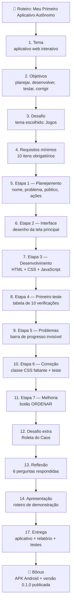
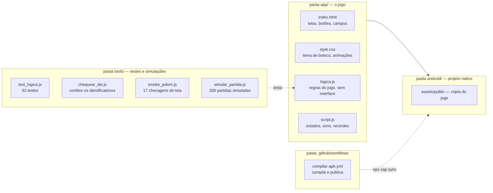
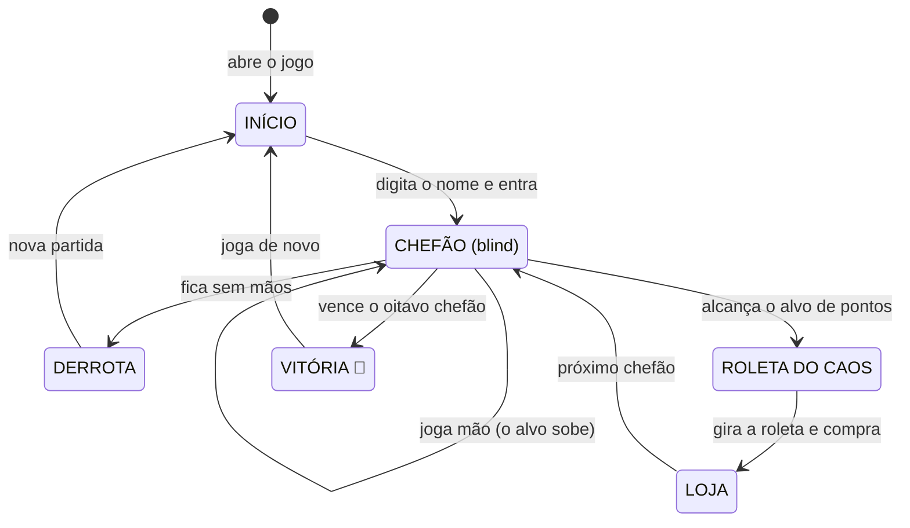
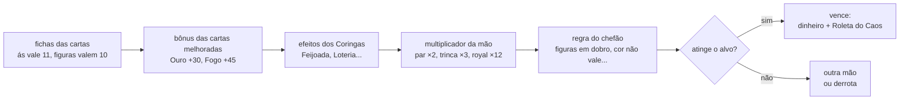
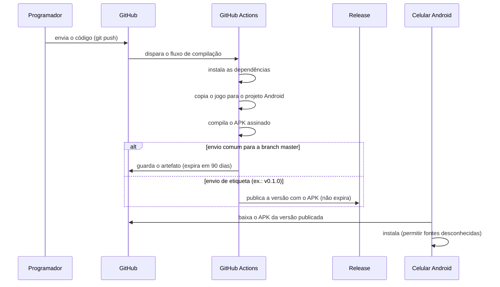

# 🃏 Pôquer do Caos

Jogo de pôquer caótico em turnos, inspirado em *Balatro*: sobreviva a **8 chefões** armando mãos absurdas e combinando **Coringas brasileiros** que quebram as regras do jogo.

Feito 100% com **HTML + CSS + JavaScript puro** (sem frameworks, sem bibliotecas, sem imagens — as cartas são desenhadas em CSS). Roda no navegador **e** no celular como APK Android.

---

## 🗺️ Mapa das etapas do trabalho

O caminho completo, do roteiro escolar até o APK publicado:



Cada etapa está detalhada em `relatorio.md` (versão entregue: `relatorio.docx`).

---

## 🎮 Como jogar

1. Digite seu nome na tela inicial;
2. Cada chefão tem um **alvo de pontos** e uma **regra caótica** própria;
3. Você recebe 8 cartas — selecione de 1 a 5 e **jogue a mão** (fichas × multiplicador) ou **descarte**;
4. Tem **4 mãos e 3 descartes** por chefão;
5. Venceu? Ganhe dinheiro, gire a **Roleta do Caos** e compre **Coringas** na loja;
6. Vença os 8 chefões e proclame-se **Rei do Boteco** 👑.

## ✨ Recursos

- **10 combinações de pôquer** (Carta Alta até Royal Flush), cada uma com fichas e multiplicador;
- **16 Coringas brasileiros** com efeitos que quebram regras (Carnavalesco, Feijoada, Loteria, Capivara Zen...) — 3 raros só entram na loja com o desbloqueio "Colecionador";
- **8 chefões com regras caóticas** ("Cor não vale como Cor", "todas as cartas valem 10", "multiplicador aleatório por mão"...) e alvos escalando de 300 até **150.000** pontos;
- **Contagem de pontos à Balatro**: fichas e ×mult pulsam na tela, cada carta ativa uma a uma, os Coringas disparam em sequência e o total **explode** ao final;
- **Falas dos chefões** em 4 momentos: entrada, 75% do alvo, sua vitória e sua derrota;
- **Caixa do Boteco (roguelite)**: 7 desbloqueios permanentes que a derrota libera (mais dinheiro inicial, Coringa de graça, juros maiores, Coringas raros...);
- **Economia de boteco**: juros do caixa (+$1 por $10 guardados) e custo de nível progressivo ($2 + $1 a cada 2 níveis);
- **4 espaços de Coringa** (não 5): +2 espaços compráveis na loja por $10 (estilo voucher do Balatro);
- **Níveis de mão**: repetir uma combinação a deixa permanentemente mais forte;
- **Loja**: Coringas, cartas melhoradas (Ouro, Fogo, Biônica, Espelho) e upgrade de mãos;
- **Roleta do Caos** com 6 prêmios aleatórios após cada vitória;
- **Sons sintetizados** com Web Audio API (sem arquivos de áudio);
- **Recordes e estatísticas** salvos no `localStorage`;
- **Animações em CSS puro**: cascata das cartas, "pop" da pontuação, tremor de tela, confete;
- **Responsivo**: layout fluido com `clamp()`, pensado para toque em celular.

## 🏗️ Arquitetura do projeto



Visão em árvore de pastas:

```
trab_2bi/
├── app/                        # O JOGO (também é a webDir do Capacitor)
│   ├── index.html              # Estrutura: 4 telas + 4 janelas sobrepostas (54 IDs)
│   ├── style.css               # Tema "boteco" (verde feltro + dourado), cartas em CSS puro, @keyframes
│   ├── logica.js               # LÓGICA PURA (sem DOM): baralho, mãos, pontuação, Coringas, chefões
│   ├── script.js               # INTERFACE: máquina de estados, renderização, sons, recordes
│   ├── manifest.json           # Manifest PWA (nome, ícones, cores)
│   └── icons/                  # Ícones do app gerados por script
├── tools/                      # FERRAMENTAS (não entram no APK)
│   ├── test_logica.js          # 32 testes unitários da lógica pura
│   ├── chequear_ids.js         # Valida que todo ID usado no JS existe no HTML
│   ├── smoke_jsdom.js          # 17 verificações de interface simulada (jsdom)
│   ├── simular_partida.js      # Simulador Monte Carlo (200 partidas) p/ balanceamento
│   └── generar_iconos.py       # Gera os ícones Android/PWA (Pillow)
├── android/                    # Projeto nativo Android (Capacitor)
├── .github/workflows/
│   └── compilar-apk.yml        # CI: compila o APK e publica Release por etiqueta (v*)
├── capacitor.config.json       # Config do Capacitor (appId, webDir)
├── relatorio.md / .docx        # Relatório do trabalho (roteiro escolar)
└── package.json                # Scripts (test, simular, apk:local)
```

### Decisão técnica central: lógica separada da interface

`logica.js` **não conhece o DOM** — funciona tanto no navegador quanto no Node.js:

```js
// No navegador (index.html)
window.LOGICA = LOGICA;
// No Node.js (testes)
if (typeof module !== 'undefined') module.exports = LOGICA;
```

Isso permite **testar o jogo de verdade** sem abrir navegador:

| Comando | O que faz |
|---|---|
| `npm test` | 32 testes unitários + validação de IDs + 17 verificações de interface (jsdom) |
| `npm run simular` | Simula 200 partidas com jogadores aleatórios e mostra a taxa de vitória |
| `npm run apk:local` | Sincroniza e compila o APK localmente (requer Android SDK) |

### Máquina de estados da interface



### Fluxo da pontuação (ordem importa!)



Toda essa cadeia vive em `logica.js` (`calcularPuntaje`), e é coberta pelos testes unitários.

## 📱 Gerando o APK

O APK é compilado **automaticamente** pelo GitHub Actions em dois momentos:

- **A cada envio comum** para a branch `master`: o APK fica como **artefato** na aba Actions (ZIP com o `.apk`; expira em 90 dias);
- **A cada etiqueta de versão** (`v*`): o APK é publicado numa **Release permanente**, com link fixo para download.

### Baixar o APK pronto (Release)

- **Versão atual: [v0.1.0](https://github.com/Lokan96/poker-do-caos/releases/tag/v0.1.0)** — arquivo `app-debug.apk` (~4 MB);
- Na página da Release, clique em `app-debug.apk` para baixar;
- Instale no Android permitindo "fontes desconhecidas" — funciona offline.

### Publicar uma versão nova

Depois de qualquer mudança, basta criar uma etiqueta e enviá-la — o resto é automático:

```bash
git tag v0.2.0
git push origin v0.2.0
```

O fluxo compila o APK novo e cria a Release com o arquivo — sem nenhum passo manual.

### Do código ao APK (pipeline completo)



**O mesmo fluxo, em texto:**

```
push → GitHub Actions (ubuntu, Java 17 + Android SDK pré-instalados)
     → npm install → npx cap sync android   (copia app/ para o projeto Android)
     → ./gradlew assembleDebug   (APK debug = assinado automaticamente, instalável)
     → upload do artefato .apk            (push comum)
     → publicação da Release com o .apk   (push com etiqueta v*)
```

O APK pesa ~4 MB: o jogo é texto puro (HTML/CSS/JS), as cartas são CSS (sem imagens) e o navegador usado é o **WebView do próprio Android** (não vem embutido).

## 🎰 Correção da Roleta do Caos (desafio extra)

No primeiro teste no celular apareceu um **problema real**: os prêmios da roleta não eram visíveis — a tira de segmentos colapsava dentro do WebView do Android, e a roleta parecia vazia.

**O que foi corrigido:**

- No `style.css`, a tira ganhou `min-width: 100%` e os segmentos `flex-shrink: 0` (não encolhem mais);
- No `script.js`, a largura total da tira passou a ser calculada via JavaScript (número de segmentos × largura do segmento), garantindo a exibição até em WebViews antigos.

**Melhoria feita junto:** o prêmio sorteado agora aparece **com legenda explicativa** no campo de resultado — nome do prêmio em destaque + descrição do efeito (ex.: *"No próximo chefão, a pontuação vale o dobro"*). Antes mostrava só o nome, e o jogador não sabia o que o prêmio fazia.

## 🧪 Qualidade

- 53 testes unitários da lógica (avaliação de mãos, Coringas, regras dos chefões, juros, linha do tempo da pontuação);
- Verificação automática de que todo ID referenciado no JS existe no HTML;
- Teste de fumaça da interface com jsdom (fluxo completo: iniciar → contagem animada → vencer → loja);
- Balanceamento calibrado com 1.000 partidas simuladas (Monte Carlo): a taxa de vitória da IA perfeita caiu de 98% (antes do Ato 2) para **26%**.

## 📄 Licença e contexto

Projeto escolar da disciplina de Desenvolvimento de Sistemas — atividade "Meu Primeiro Aplicativo Autônomo". O relatório completo está em `relatorio.md` (versão editável) e `relatorio.docx` (entrega).

APK instalável publicado permanentemente na [Release v0.1.0](https://github.com/Lokan96/poker-do-caos/releases/tag/v0.1.0) — e a cada etiqueta nova (`v0.2.0`, ...) o fluxo publica a versão seguinte sozinho.
